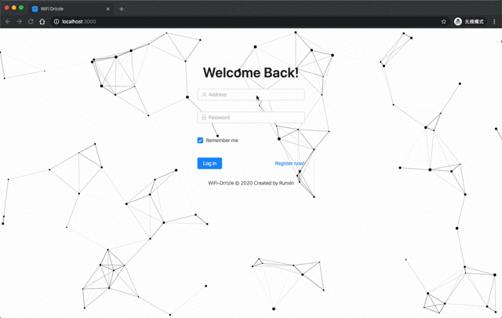
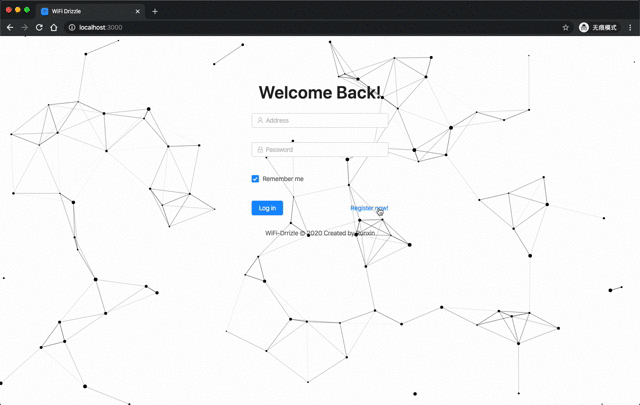
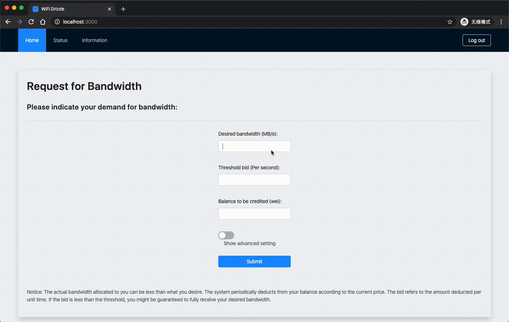
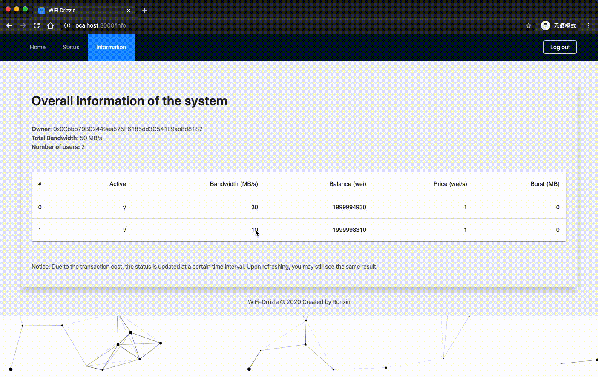
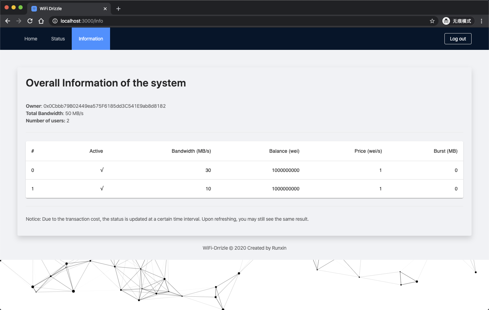
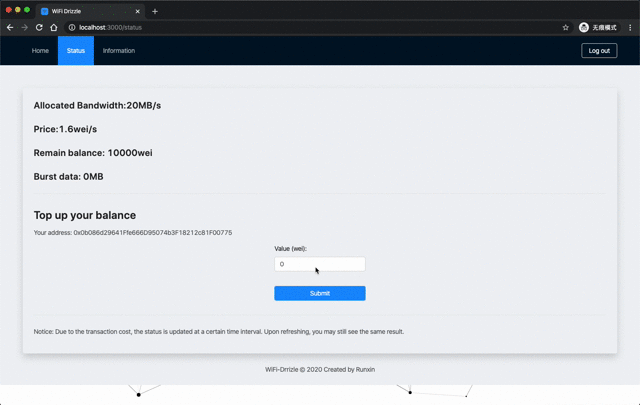

# WiFi on the chain

This is the all-in-one repo for my CP3106 project.

## Introduction

WiFi on the chain is a bidding based wireless resource allocation system using blockchian smart contract.

## Features

1. Log in

    

- Use `web3.eth.personal.unlockAccount` to verify the user.
- Both `password` and `privatekey` are able to verify.

2. Register

    

3. Request for bandwidth
    
    - Request may be rejected

    

    - If success

    

4. System Info

    

5. Top up balance

    

## [Document](https://blog.aaron-xin.tech/wifi-on-chain)

For the detailed documentation, please refer to upper link.

# 欢迎小松松！！！